# spacedefense - [play](https://github.com/ravegoth/spacedefense/raw/main/spacedefense%20setup.ps1)

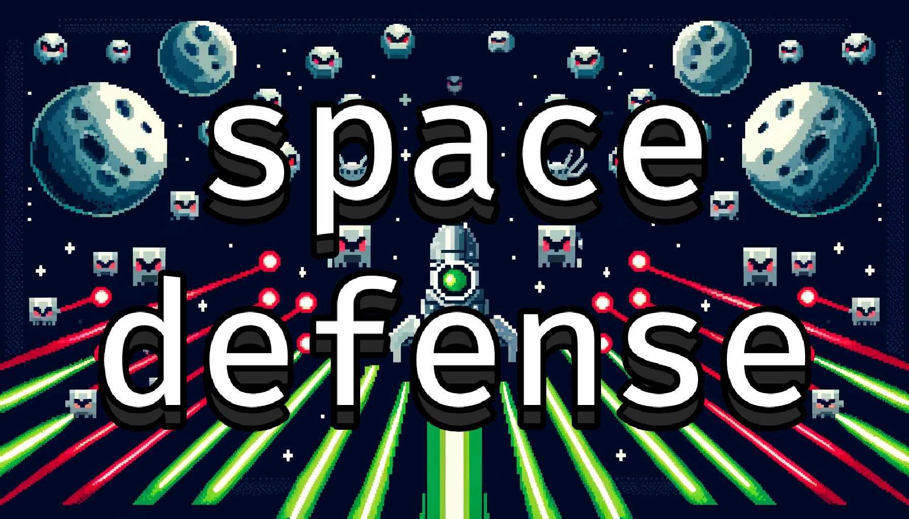

## Description

A simple game where you have to defend your spaceship from evil enemies.
You can explore planets and extraterrestrial life.

## How to play

### Mechanics

- **Spaceship** - you control a spaceship that can shoot and move, you can move only in the direction you are facing
- **Enemies** - enemies will spawn randomly and will try to destroy your spaceship, if your health reaches 0 you lose, they get stronger and stronger and they might have bullets with properties such as zigzag, splitter, etc...
- **Pickups** - pickups will be dropped by enemies, you can disable them by clicking on their icon, bottom left corner
- - **small health** - will increase your health a lil bit
- - **big health** - will increase your health a lot
- - **medkit** - will heal you completely
- - **small shield** - will increase your shield a lil bit
- - **big shield** - will increase your shield a lot
- - **fuel** - will increase your fuel
- - **freeze** - your bullets will stay in the place you shot them
- - **gravitational** - your bullets will be attract other bullets and enemies
- - **splitter** - your bullets will clone themselves but at 90 degrees and -90 degrees sometimes
- - **boomerang** - edges will reflect your bullets
- - **zigzag** - your bullets will move change their direction randomly
- - **homing** - your bullets will follow the enemies
- - **remote control** - you can control your bullets with your mouse
- - **faster bullets** - your fire rate will increase
- - **better bullets** - your bullets will deal more damage
- **Planets** - you can explore planets. they are a safe place, enemies will not spawn here, your shield will regenerate, every planet has a different language
- **Moons** - they will give you fuel but they are not a safe place, they will orbit a planet
- **Aliens** - friendly creatures, they will shoot at nearby enemies, they talk to each other if they are on a planet, they look procedurally generated
- **Fuel bar** - you need fuel to move, if you run out of fuel you will not be able to move
- **Shield bar** - shows your shield, if it reaches 0, your health will decrease if you get hit
- **Health bar** - shows your health, if it reaches 0 you lose
- **Coins** - this is your score basically, you receive coins by killing enemies and exploring new planets/moons
- **Gamble** - when you lose, before saving your score to the leaderboard (scores.txt), you can gamble half of your coins to get a better score
- **Lightspeed** - when holding L, you will move faster, but the fuel will decrease faster, the trail effect will be enabled
- **Arrows** - at the edge of the screen, arrows will show you where the aliens are, where are the planets and where are the moons

### Controls
- **Mouse** - change spaceship direction
- **Click** - shoot
- **W** - move
- **L** - light speed on
- **Space** - stop spaceship
- **M** - mute/unmute music
- **P** - pause/unpause game
- **R** - suicide (to restart the game)
### Cheat-codes / Admin keys
- **Right Click and K** - kill all enemies
- **Right Click and Q** - spawn pickups randomly

## Installation + Play Game

**Windows**

You can install it ~~automatically using the **[setup](https://github.com/ravegoth/spacedefense/raw/main/bin/spacedefense%20setup.exe)** executable or~~ manually using [git](https://git-scm.com/) like this:
```bash
git clone https://github.com/ravegoth/spacedefense
cd spacedefense
run-game.bat
```
or using powershell (run it as admin):
```ps
$repoUrl = "https://github.com/ravegoth/spacedefense/archive/refs/heads/main.zip"
$zipFile = "spacedefense.zip"
$extractPath = "spacedefense-main"
Invoke-WebRequest -Uri $repoUrl -OutFile $zipFile
Expand-Archive -Path $zipFile -DestinationPath . -Force
Remove-Item $zipFile
Set-Location $extractPath
Start-Process "run-game.bat"
```

## Building

**Windows**
1. Install [MinGW](http://www.mingw.org/)
2. Install [SFML](https://www.sfml-dev.org/download.php)
3. Add MinGW and SFML to PATH
4. Edit the run.bat and edit the following line with the location of your g++ compiler and SFML libraries (if you installed them in a different location)
```
C:\mingw64\bin\g++ src/main.cpp -o bin/spacedefense.exe -I "C:\SFML-2.6.1\include" -L "C:\SFML-2.6.1\lib" -lsfml-graphics -lsfml-window -lsfml-system -lsfml-audio -lsfml-network -mwindows -static-libgcc -static-libstdc++
```
5. Clone the repository
```bash
git clone https://github.com/ravegoth/spacedefense
```
6. Run the following commands:
```bash
cd spacedefense
run
```
**Note:** Sometimes you have to build the SFML libraries yourself. You can find the instructions [here](https://www.sfml-dev.org/tutorials/2.5/compile-with-cmake.php)

### Credits
- [SFML](https://www.sfml-dev.org/)
- [space madness font](https://www.dafont.com/space-madness.font)
- background music made by [1sirrackz](https://soundcloud.com/1sirrackz)
- sound effects made using [ZzFX](https://killedbyapixel.github.io/ZzFX/)
- some images are made using [DALL-E](https://openai.com/dall-e/)

### Planets

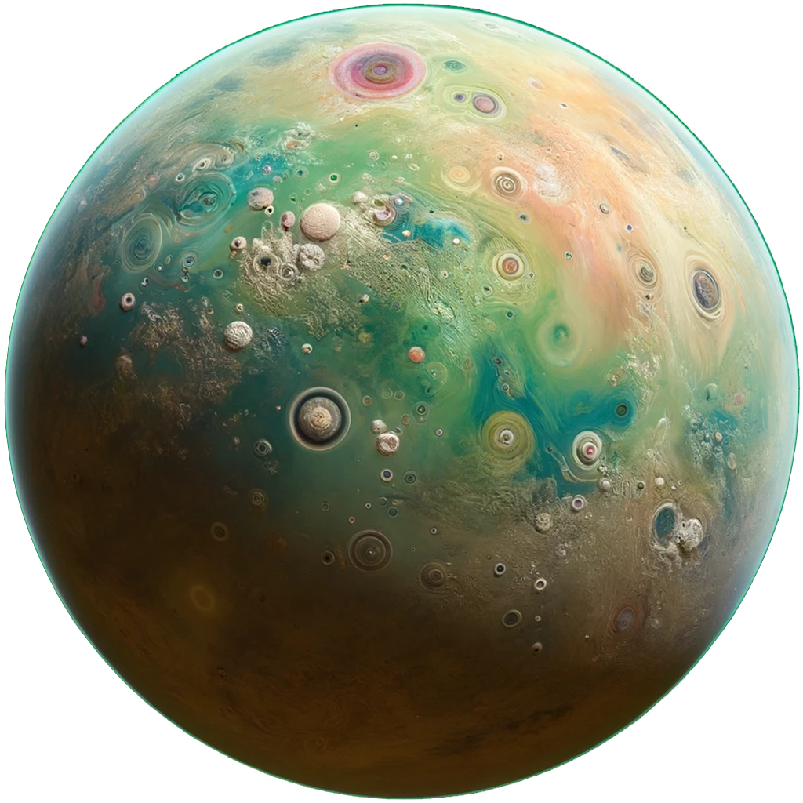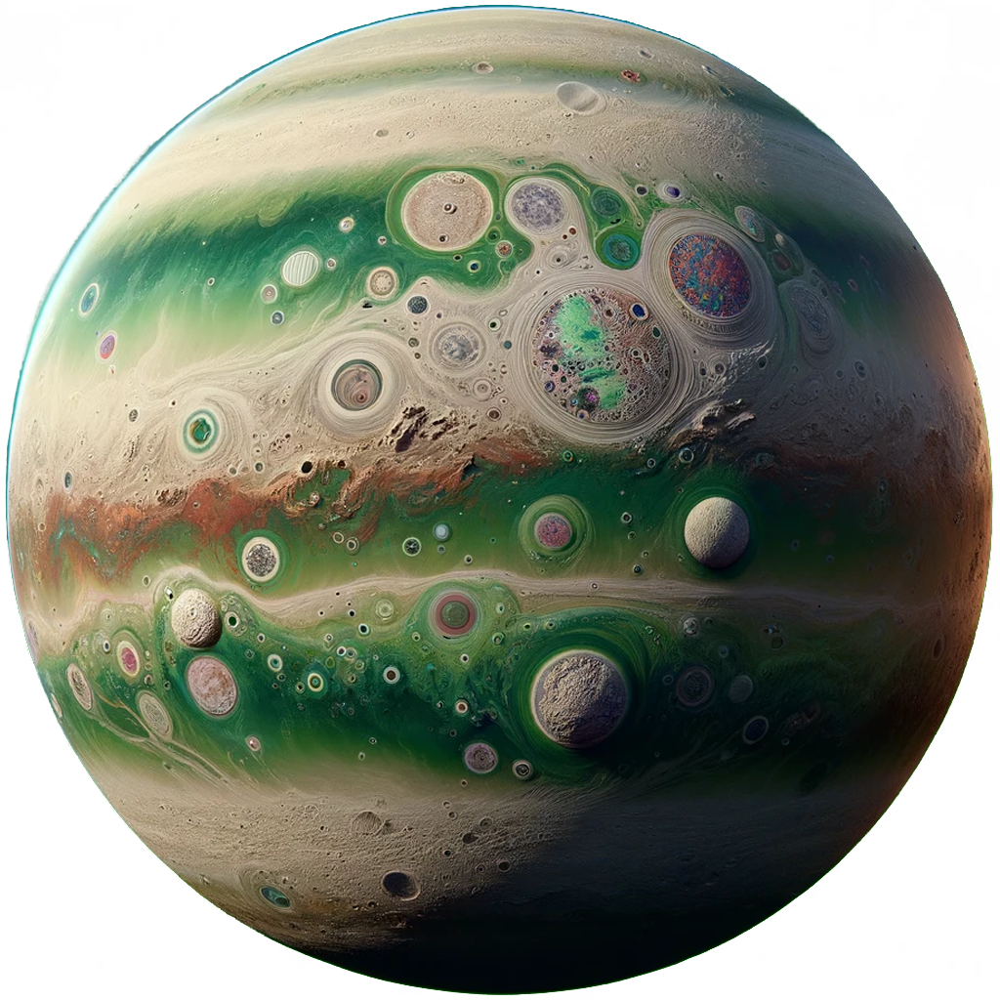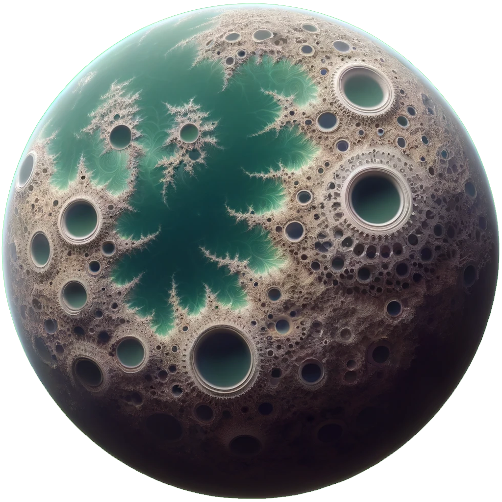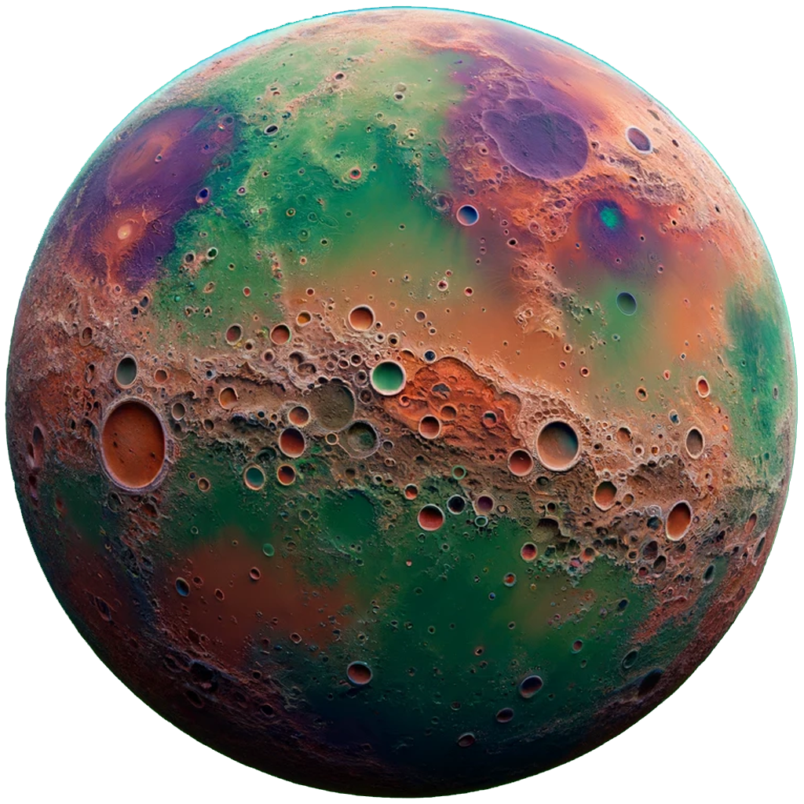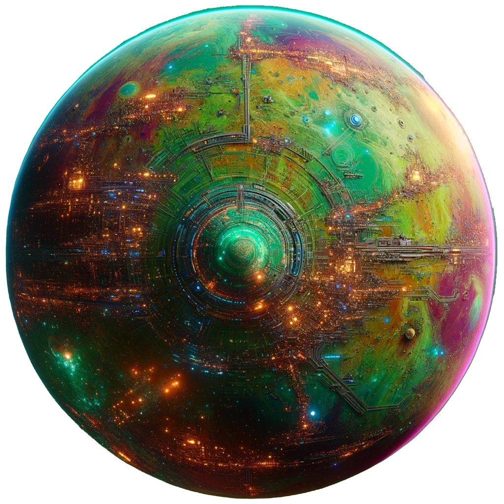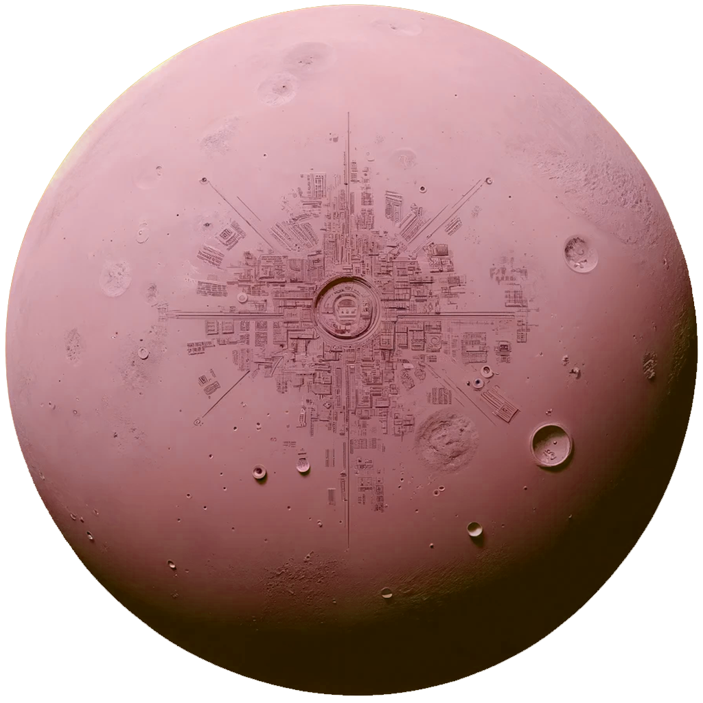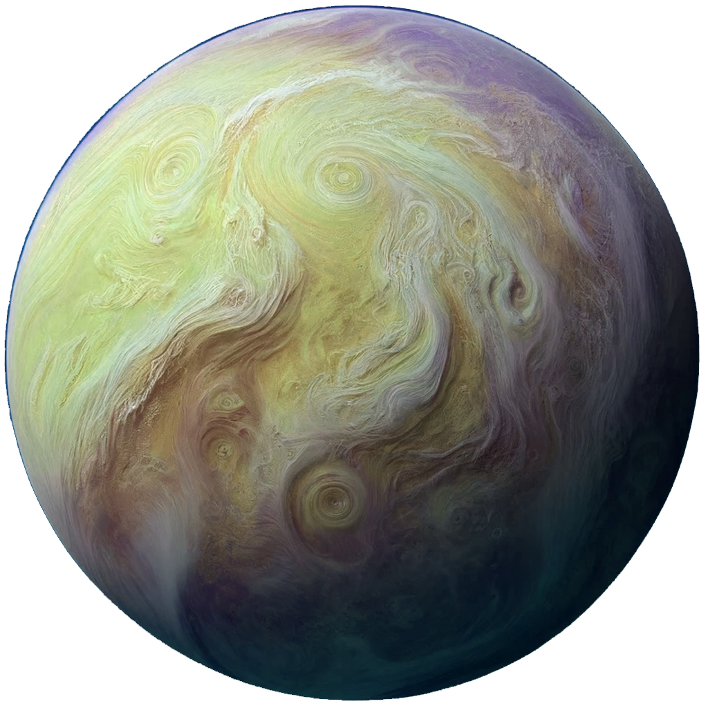

### Moons

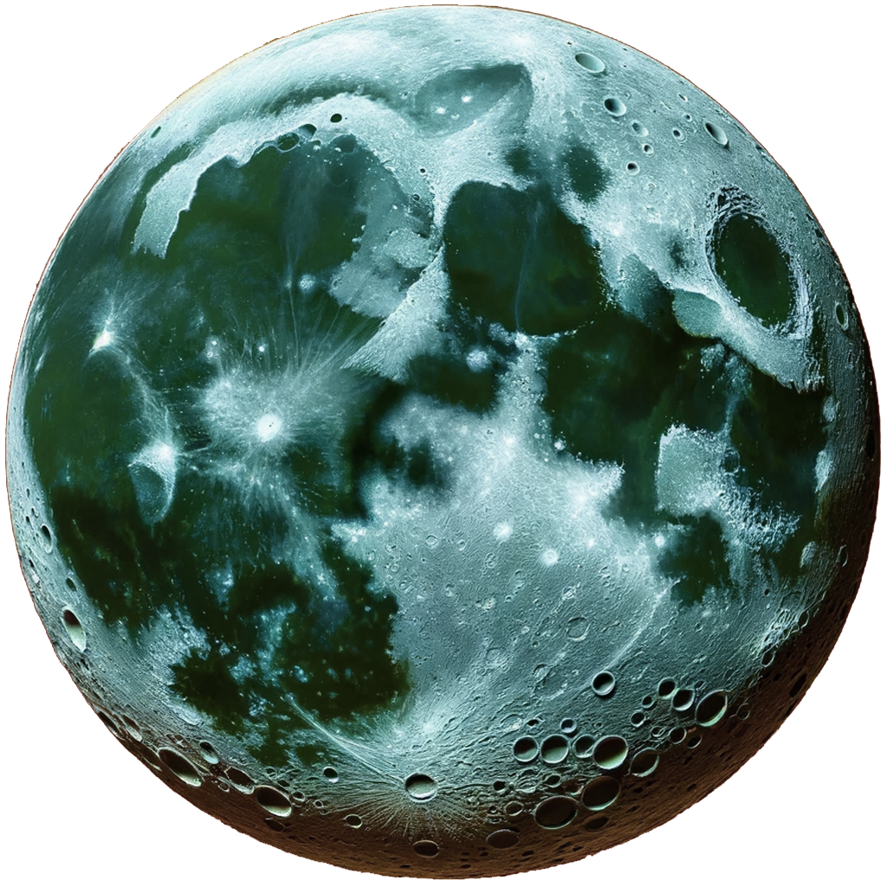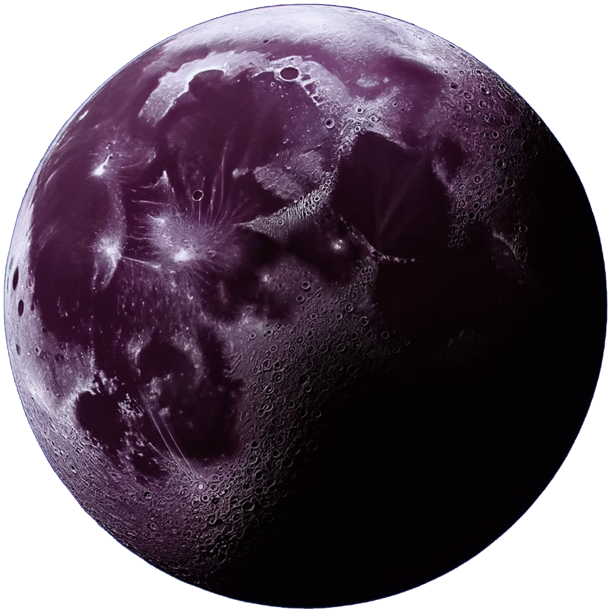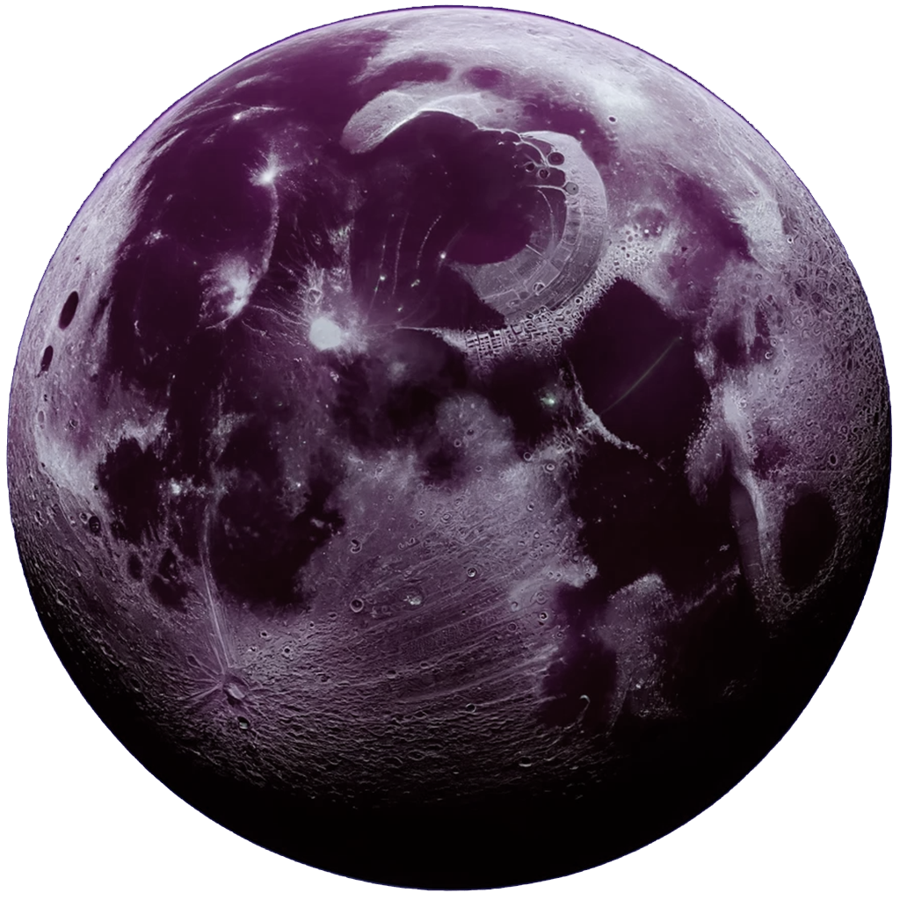

### Pickups


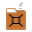


### Sounds

- [Alien Laser Sound Effect](./res/alien_laser.wav)
- [Background Music](./res/bgmOld.wav)
- [Click](./res/button_click.wav)
- [Coin Pickup](./res/coin_pickup.wav)
- [End Game](./res/end_game.wav)
- [Enemy Dead](./res/enemy_dead.wav)
- [Enemy Gets Hit](./res/enemy_hit.wav)
- [Enemy Laser](./res/enemy_laser.wav)
- [Enemy Spawn](./res/enemy_spawn.wav)
- [Pickup](./res/pickup.wav)
- [Player Gets Hit](./res/player_hit.wav)
- [Player Laser](./res/player_laser.wav)
- [Bullets Split](./res/splitter.wav)

### Objects

**main.cpp** - main game file
- exception
- - ^^^ HideCmdWindowsException 
- Star
- Particle
- particleEngine
- Bullet
- Player
- Enemy
- Pickup 
- - ^^^ pickupSmallShield
- - ^^^ pickupBigShield
- - ^^^ pickupSmallHealth
- - ^^^ pickupBigHealth
- - ^^^ pickupMedkit
- - ^^^ pickupFuel
- - ^^^ pickupBetterGun
- - ^^^ pickupFasterShooting
- - ^^^ pickupBoomerang
- - ^^^ pickupFreeze
- - ^^^ pickupZigzag
- - ^^^ pickupSplitter
- - ^^^ pickupRemoteControl
- - ^^^ pickupHoming
- - ^^^ pickupGravitational
- Planet
- - ^^^ Moon
- Coin
- Alien

**brain.h** - header that will handle AI structures
- Brain
- - ^^^ TwoOutputsBrain
- - ^^^ Perceptron
- - - ^^^ slowSinPerceptron
- - - ^^^ tanhPerceptron
- - - ^^^ sigmoidPerceptron
- - - ^^^ reluPerceptron
- - - ^^^ leakyReluPerceptron
- - - ^^^ eluPerceptron
- - - ^^^ slowCosPerceptron
- - - ^^^ chaoticTanPerceptron
- - - ^^^ tanAtanPerceptron
- - - ^^^ sumSinPerceptron

**clock.h** - header that will handle timestamps (used for difficulty scaling)
- ClockStamp
- - ^^^ MinuteStamp

**sounds.h** - header that will handle sound effects
- SoundPlayer
- SoundEngine (singleton)
- SoundTrackPlayer

**textgen.h** - header that will handle text generation and language
- TextGen (singleton)
- Language

### Other files

- **autocommit.py** - script that will automatically commit changes to the repository and push them to the remote repository (commit message is the unix timestamp)
- **autopull.py** - script that will automatically pull changes from the remote repository
- **run.bat** - script that will compile the game and run it
- **test-run.bat** - script that will compile the tester.cpp and run it
- **home-run.bat** - compile & run but has the compilers I use at the home computer XD
- **home-test-run.bat** - compile and run the tester.cpp
- **scores.txt** - file that will store the leaderboard (it will be created after player dies)
- **src/tester.cpp** - file that I used to test headers and objects
- **res/...** - resources such as images, sounds, fonts, etc...
- **line_counter.py** - script that will count the lines of code in the project and time elapsed (approximately)
- **run-game.bat** - script that will run the game, without compiling it

### License & Copyright

**I OWN ALL RIGHTS TO THIS GAME CODE AND ASSETS. YOU ARE NOT ALLOWED TO USE THIS CODE OR ASSETS WITHOUT MY PERMISSION.**

© 2024 traian
